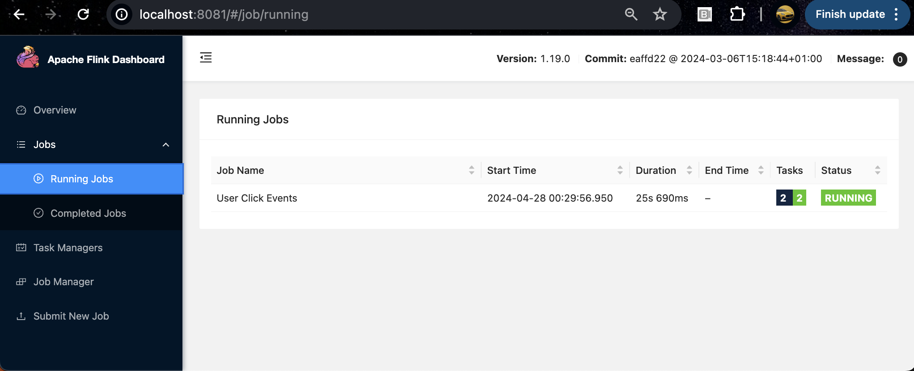
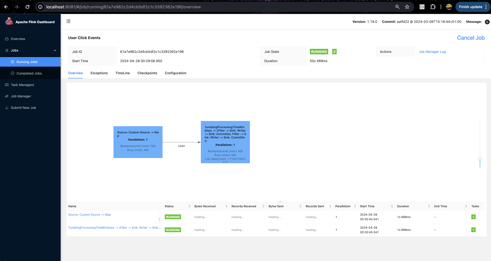

### Apache Flink Examples

Prerequisites:
* JDK installed
* mvn installed
* [Flink](https://nightlies.apache.org/flink/flink-docs-release-1.13/docs/try-flink/local_installation/) installed 

Download the repo:
```bash
git clone https://github.com/gmflau/apache-flink-examples
cd apache-flink-examples
```
For userClickEvents:    
```bash
cd userClickEvents
```
Edit and update this [line](https://github.com/gmflau/apache-flink-examples/blob/main/userClickEvents/src/main/java/com/acmecorp/StreamingJob.java#L68) to reflect your local directory:
```
String outputPathForTenPlus = "/Users/glau/Documents/Flink/UserEvents/output/userevents_10plus";
```
Edit and update this [line](https://github.com/gmflau/apache-flink-examples/blob/main/userClickEvents/src/main/java/com/acmecorp/StreamingJob.java#L80) to reflect your local directory:
```
String outputPathForLessThanTen = "/Users/glau/Documents/Flink/UserEvents/output/userevents_less_than_10";
```
Build:
```bash
mvn clean install
```
Submit a Flink job locally:
```bash
flink run target/task-1.2.2-SNAPSHOT.jar
```
#### Apache Flink Dashboard
Running Jobs:

User Click Events Job Page:    



